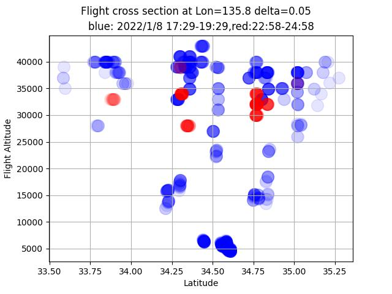

# ADSB-vertical-slicer
 
ADSB flight data slicer by python and pandas

## What this program shows

I'm interested in 3D route of air crafts flying over my head. Mostly to/from East/West
along Western Japan. 
This program generates latitude-altitude sliced scatter plot of air crafts
of two different time range, i.e. business and travel hours(blue) and midnight (red)
at the specified longitude. 

High altitude air traffic in midnight is international cargo planes.
Low altitude routes are to/from the nearby airports.
In this example , around 5000 feet is a route to land on ITM(Osaka Airport) and around 15000 feet is a route to KIX(Kansai Airport).

## How to do
Prepare CSV data as follows

Install RTL-SDR software on Jetson or Raspberry pi or Windows. (I used Jetson nano)

Install dump1090 from https://github.com/MalcolmRobb/dump1090

Run dump1090 as a network server.

	 $ ./dump1090 --net

Open another terminal, run nc command for 7200sec to make csv

	 $ timeout 7200 nc localhost 30003 > adsb1.csv

Run once again to get CSV in midnight

	$ timeout 7200 nc localhost 30003 > adsb2.csv

Edit this code and give these two csv in adsb1 and adsb2.

Change "baselon" to your neighbor longitude to get a slice.

Output is a sliced traffic at specified longitude in  adsb.jpg

LICENSE Apache 2.0

copyright 2022 by coniferconifer
